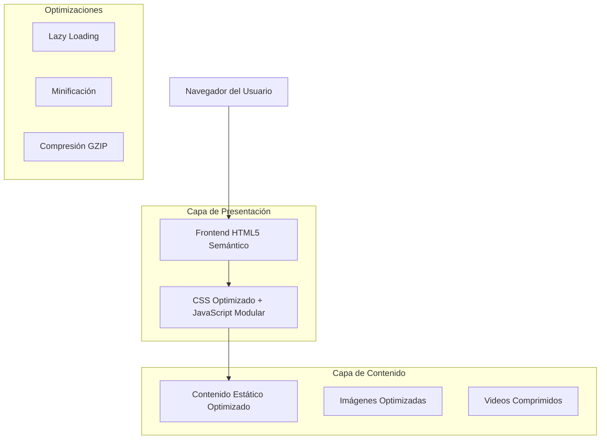

# Arquitectura Técnica Moderna - Sitio Web Espiritual

## 1. Diseño de Arquitectura



## 2. Descripción de Tecnologías

- **Frontend**: HTML5 Semántico + CSS3 Moderno + JavaScript Vanilla ES6+
- **Optimización**: Webpack para bundling, PostCSS para autoprefixing
- **Fuentes**: Google Fonts optimizadas con font-display: swap
- **Imágenes**: WebP con fallback JPEG, lazy loading nativo
- **Videos**: MP4 optimizado con poster frames

## 3. Definiciones de Rutas

| Ruta | Propósito |
|------|----------|
| / | Página de inicio con hero section y servicios destacados |
| /servicios | Catálogo completo de servicios espirituales |
| /sobre-nosotros | Historia personal y credenciales |
| /testimonios | Experiencias y casos de éxito de clientes |
| /blog | Artículos espirituales y guías de valor |
| /blog/[slug] | Artículo individual del blog |
| /contacto | Formularios de contacto y sistema de citas |
| /galeria | Galería de imágenes espirituales |

## 4. Estructura HTML5 Semántica

### 4.1 Arquitectura Base

```html
<!DOCTYPE html>
<html lang="es" prefix="og: http://ogp.me/ns#">
<head>
    <!-- Meta tags optimizados -->
    <meta charset="UTF-8">
    <meta name="viewport" content="width=device-width, initial-scale=1.0">
    <meta name="description" content="Servicios espirituales profesionales...">
    
    <!-- SEO y Open Graph -->
    <title>Servicios Espirituales Profesionales | Guía Amorosa</title>
    <meta property="og:title" content="Servicios Espirituales Profesionales">
    <meta property="og:description" content="Consultas espirituales...">
    
    <!-- Preload crítico -->
    <link rel="preload" href="/fonts/playfair-display.woff2" as="font" type="font/woff2" crossorigin>
    <link rel="preload" href="/css/critical.css" as="style">
</head>
<body>
    <header role="banner">
        <nav role="navigation" aria-label="Navegación principal">
            <!-- Menú de navegación -->
        </nav>
    </header>
    
    <main role="main">
        <section aria-labelledby="hero-title">
            <!-- Contenido principal -->
        </section>
    </main>
    
    <aside role="complementary">
        <!-- Contenido relacionado -->
    </aside>
    
    <footer role="contentinfo">
        <!-- Información de contacto y enlaces -->
    </footer>
</body>
</html>
```

### 4.2 Componentes Semánticos Clave

**Header con Navegación:**
```html
<header class="site-header">
    <div class="container">
        <div class="site-branding">
            <h1 class="site-title">
                <a href="/" rel="home">Servicios Espirituales</a>
            </h1>
        </div>
        <nav class="main-navigation" role="navigation">
            <ul class="nav-menu">
                <li><a href="/">Inicio</a></li>
                <li><a href="/servicios">Servicios</a></li>
                <li><a href="/sobre-nosotros">Sobre Nosotros</a></li>
                <li><a href="/testimonios">Testimonios</a></li>
                <li><a href="/blog">Blog</a></li>
                <li><a href="/contacto">Contacto</a></li>
            </ul>
        </nav>
    </div>
</header>
```

**Sección Hero:**
```html
<section class="hero-section" aria-labelledby="hero-title">
    <div class="hero-content">
        <h1 id="hero-title">Encuentra tu Camino Espiritual</h1>
        <p class="hero-description">Consultas personalizadas para el amor y la armonía interior</p>
        <a href="/contacto" class="cta-button" role="button">Solicitar Consulta</a>
    </div>
    <figure class="hero-media">
        
    </figure>
</section>
```

**Artículos del Blog:**
```html
<article class="blog-post" itemscope itemtype="https://schema.org/BlogPosting">
    <header class="post-header">
        <h1 itemprop="headline">Título del Artículo</h1>
        <div class="post-meta">
            <time datetime="2024-01-15" itemprop="datePublished">15 de enero, 2024</time>
            <span itemprop="author" itemscope itemtype="https://schema.org/Person">
                <span itemprop="name">Nombre del Autor</span>
            </span>
        </div>
    </header>
    <div class="post-content" itemprop="articleBody">
        <!-- Contenido del artículo -->
    </div>
</article>
```

## 5. Optimizaciones de Rendimiento

### 5.1 Estrategias de Carga

**CSS Crítico:**
```html
<style>
/* CSS crítico inline para above-the-fold */
.hero-section { /* estilos críticos */ }
.main-navigation { /* estilos críticos */ }
</style>
<link rel="preload" href="/css/main.css" as="style" onload="this.onload=null;this.rel='stylesheet'">
```

**Lazy Loading de Imágenes:**
```html

```

**JavaScript Modular:**
```javascript
// Carga diferida de funcionalidades no críticas
if ('IntersectionObserver' in window) {
    import('./modules/lazy-loading.js');
}

// Service Worker para cache
if ('serviceWorker' in navigator) {
    navigator.serviceWorker.register('/sw.js');
}
```

### 5.2 Optimización de Fuentes

```css
@font-face {
    font-family: 'Playfair Display';
    src: url('/fonts/playfair-display.woff2') format('woff2');
    font-display: swap;
    font-weight: 400;
}

/* Fallback system fonts */
body {
    font-family: 'Open Sans', -apple-system, BlinkMacSystemFont, 'Segoe UI', Roboto, sans-serif;
}
```

## 6. Estrategia SEO y Metadatos

### 6.1 Estructura de Metadatos

```html
<!-- Meta tags básicos -->
<title>Servicios Espirituales Profesionales | Consultas de Amor</title>
<meta name="description" content="Consultas espirituales personalizadas para encontrar el amor y la armonía. Más de 15 años de experiencia ayudando a personas a transformar sus vidas.">
<meta name="keywords" content="servicios espirituales, consultas amor, guía espiritual, tarot, rituales">

<!-- Open Graph -->
<meta property="og:title" content="Servicios Espirituales Profesionales">
<meta property="og:description" content="Consultas espirituales personalizadas...">
<meta property="og:image" content="/images/og-image.jpg">
<meta property="og:url" content="https://sitio-espiritual.com">
<meta property="og:type" content="website">

<!-- Twitter Cards -->
<meta name="twitter:card" content="summary_large_image">
<meta name="twitter:title" content="Servicios Espirituales Profesionales">
<meta name="twitter:description" content="Consultas espirituales personalizadas...">

<!-- Schema.org -->
<script type="application/ld+json">
{
  "@context": "https://schema.org",
  "@type": "LocalBusiness",
  "name": "Servicios Espirituales Profesionales",
  "description": "Consultas espirituales personalizadas",
  "url": "https://sitio-espiritual.com",
  "telephone": "+1-XXX-XXX-XXXX",
  "address": {
    "@type": "PostalAddress",
    "addressCountry": "US"
  }
}
</script>
```

### 6.2 Jerarquía de Encabezados

```html
<!-- Página de Inicio -->
<h1>Servicios Espirituales Profesionales</h1>
  <h2>Nuestros Servicios Principales</h2>
    <h3>Consultas de Amor</h3>
    <h3>Guía Espiritual</h3>
    <h3>Rituales Personalizados</h3>
  <h2>Testimonios de Clientes</h2>
  <h2>Sobre Nuestra Experiencia</h2>

<!-- Página de Servicios -->
<h1>Catálogo Completo de Servicios Espirituales</h1>
  <h2>Servicios de Amor y Relaciones</h2>
    <h3>Consultas de Compatibilidad</h3>
    <h3>Rituales de Atracción</h3>
  <h2>Servicios de Protección Espiritual</h2>
    <h3>Limpiezas Energéticas</h3>
    <h3>Protección Personal</h3>
```

## 7. Plan de Multimedia

### 7.1 Estrategia de Imágenes

**Fuentes Recomendadas:**
- Unsplash.com (imágenes libres de derechos)
- Pexels.com (fotografías profesionales)
- Pixabay.com (ilustraciones y fotos)

**Categorías de Imágenes:**
- Ambientes espirituales serenos
- Elementos naturales (velas, cristales, flores)
- Espacios de meditación
- Símbolos espirituales abstractos

**Especificaciones Técnicas:**
```css
/* Responsive images */
.responsive-image {
    width: 100%;
    height: auto;
    object-fit: cover;
}

/* WebP con fallback */
.modern-image {
    background-image: url('image.webp');
    background-image: image-set(
        url('image.webp') type('image/webp'),
        url('image.jpg') type('image/jpeg')
    );
}
```

### 7.2 Optimización de Videos

```html
<!-- Video optimizado con poster -->
<video class="hero-video" 
       poster="/images/video-poster.jpg" 
       muted 
       autoplay 
       loop 
       playsinline>
    <source src="/videos/hero-video.webm" type="video/webm">
    <source src="/videos/hero-video.mp4" type="video/mp4">
    <p>Tu navegador no soporta video HTML5.</p>
</video>
```

## 8. Compatibilidad y Accesibilidad

### 8.1 Soporte de Navegadores
- Chrome 90+
- Firefox 88+
- Safari 14+
- Edge 90+

### 8.2 Características de Accesibilidad

```html
<!-- Navegación accesible -->
<nav role="navigation" aria-label="Navegación principal">
    <ul>
        <li><a href="/" aria-current="page">Inicio</a></li>
        <li><a href="/servicios">Servicios</a></li>
    </ul>
</nav>

<!-- Formularios accesibles -->
<form>
    <label for="nombre">Nombre completo</label>
    <input type="text" id="nombre" name="nombre" required aria-describedby="nombre-help">
    <div id="nombre-help">Ingresa tu nombre completo</div>
</form>

<!-- Imágenes con alt text descriptivo -->

```

### 8.3 CSS para Accesibilidad

```css
/* Respeto por preferencias de movimiento */
@media (prefers-reduced-motion: reduce) {
    * {
        animation-duration: 0.01ms !important;
        animation-iteration-count: 1 !important;
        transition-duration: 0.01ms !important;
    }
}

/* Alto contraste */
@media (prefers-contrast: high) {
    .button {
        border: 2px solid currentColor;
    }
}

/* Focus visible */
.button:focus-visible {
    outline: 2px solid #D4AF37;
    outline-offset: 2px;
}
```