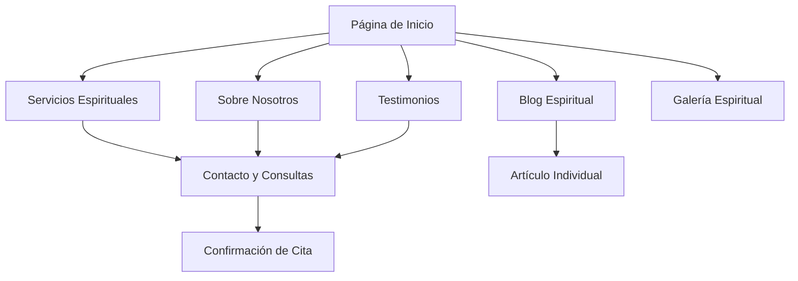

# Rediseño Completo del Sitio Web de Servicios Espirituales

## 1. Visión General del Proyecto

Transformación completa del sitio web de servicios espirituales para crear una experiencia moderna, rápida y optimizada que mantenga la esencia espiritual pero con una interfaz contemporánea y profesional.

- **Objetivo**: Rediseño total con HTML5 semántico, contenido renovado y optimización integral
- **Propósito**: Servicios espirituales, consultas amorosas y guía espiritual personalizada
- **Meta**: Experiencia de usuario excepcional con carga ultrarrápida y diseño moderno

## 2. Características Principales

### 2.1 Roles de Usuario
| Rol | Método de Acceso | Permisos Principales |
|-----|------------------|----------------------|
| Visitante | Acceso directo | Navegación, consulta de servicios, contacto inicial |
| Cliente Potencial | Formulario de contacto | Solicitud de consultas, acceso a contenido premium |
| Cliente Registrado | Sistema de citas | Seguimiento de servicios, historial de consultas |

### 2.2 Módulos de Funcionalidad

Nuestro sitio renovado constará de las siguientes páginas principales:

1. **Página de Inicio**: Hero section moderno, navegación intuitiva, servicios destacados, testimonios dinámicos
2. **Servicios Espirituales**: Catálogo completo, descripciones detalladas, precios transparentes
3. **Sobre Nosotros**: Historia personal, credenciales, filosofía espiritual
4. **Testimonios**: Experiencias reales, casos de éxito, galería de agradecimientos
5. **Blog Espiritual**: Artículos de valor, guías espirituales, consejos amorosos
6. **Contacto y Consultas**: Formularios optimizados, información de contacto, sistema de citas
7. **Galería Espiritual**: Imágenes de rituales, espacios sagrados, elementos espirituales

### 2.3 Detalles de Páginas

| Página | Módulo | Descripción de Funcionalidad |
|--------|--------|------------------------------|
| Inicio | Hero Section | Presentación impactante con llamada a la acción clara, video de fondo sutil |
| Inicio | Servicios Destacados | Grid de servicios principales con iconografía moderna y descripciones concisas |
| Inicio | Testimonios Dinámicos | Carrusel de testimonios reales con fotos y experiencias auténticas |
| Servicios | Catálogo Completo | Lista organizada de servicios con filtros, precios y descripciones detalladas |
| Servicios | Proceso de Trabajo | Explicación paso a paso del proceso espiritual y metodología |
| Sobre Nosotros | Historia Personal | Narrativa auténtica sobre experiencia y trayectoria espiritual |
| Sobre Nosotros | Credenciales | Certificaciones, estudios y reconocimientos en el campo espiritual |
| Testimonios | Casos de Éxito | Historias reales de transformación y resultados positivos |
| Testimonios | Galería de Agradecimientos | Mensajes de clientes satisfechos con fotos opcionales |
| Blog | Artículos Espirituales | Contenido de valor sobre amor, espiritualidad y crecimiento personal |
| Blog | Guías Prácticas | Tutoriales y consejos para el desarrollo espiritual personal |
| Contacto | Formulario Inteligente | Sistema de contacto con validación y respuesta automática |
| Contacto | Sistema de Citas | Calendario interactivo para agendar consultas personalizadas |
| Galería | Espacios Sagrados | Fotografías profesionales de ambientes y elementos espirituales |

## 3. Flujo de Navegación Principal

El usuario inicia en la página principal donde encuentra una presentación clara de los servicios. Puede explorar el catálogo completo, conocer la historia personal, leer testimonios auténticos y finalmente contactar para una consulta personalizada.

## 4. Diseño de Interfaz de Usuario

### 4.1 Estilo de Diseño

- **Colores Primarios**: #2C1810 (marrón profundo), #D4AF37 (dorado elegante)
- **Colores Secundarios**: #F5F5DC (beige suave), #8B4513 (marrón medio), #FFFFFF (blanco puro)
- **Estilo de Botones**: Bordes redondeados suaves (8px), efectos hover elegantes
- **Tipografía**: Playfair Display para títulos, Open Sans para texto general, tamaños 16px-18px base
- **Estilo de Layout**: Diseño limpio con espaciado generoso, cards con sombras sutiles
- **Iconografía**: Iconos minimalistas relacionados con espiritualidad, corazones, estrellas, elementos naturales

### 4.2 Resumen de Diseño por Página

| Página | Módulo | Elementos de UI |
|--------|--------|----------------|
| Inicio | Hero Section | Fondo degradado sutil, tipografía grande y elegante, botón CTA dorado prominente |
| Inicio | Servicios | Grid responsive 3 columnas, cards con hover effects, iconos dorados |
| Servicios | Catálogo | Layout de lista con imágenes circulares, precios destacados, botones de acción |
| Sobre Nosotros | Historia | Diseño de dos columnas con imagen personal y texto narrativo |
| Testimonios | Casos de Éxito | Cards testimoniales con estrellas doradas, fotos circulares opcionales |
| Blog | Artículos | Grid de artículos con imágenes destacadas, fechas y extractos |
| Contacto | Formularios | Campos con bordes dorados, validación visual, diseño centrado |
| Galería | Imágenes | Grid masonry responsive con lightbox, filtros por categoría |

### 4.3 Responsividad

Diseño mobile-first con breakpoints en 768px y 1024px. Optimización táctil para dispositivos móviles con botones de tamaño adecuado y navegación simplificada. Menú hamburguesa elegante en móviles.